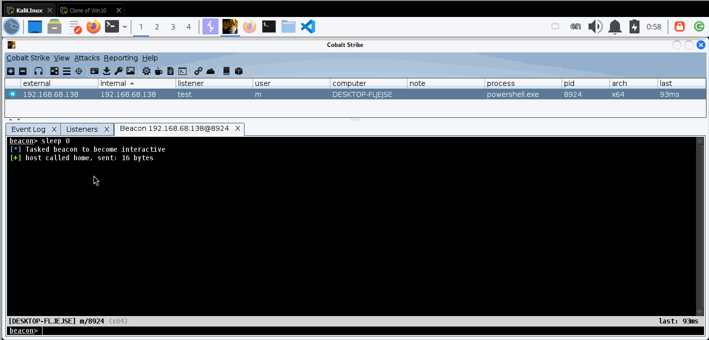

# BCTextEncoder-Thief
Extracting Clear Text Passwords from BCTextEncoder using API Hooking.

Code and project name are modified from [RdpThief](https://github.com/0x09AL/RdpThief).

Learning from:
1. Red Team Notes: [API Monitoring and Hooking for Offensive Tooling](https://www.ired.team/offensive-security/code-injection-process-injection/api-monitoring-and-hooking-for-offensive-tooling)
2. Rio Sherri: [RdpThief: Extracting Clear-text Credentials from Remote Desktop Clients](https://www.mdsec.co.uk/2019/11/rdpthief-extracting-clear-text-credentials-from-remote-desktop-clients/)
3. Ariasaka: [运用 Windows 的 Hook 淦极域 && MinHook 入门教程](https://yisous.xyz/posts/mhaoxonk/)

Detailed walkthrough in [this post](https://mark0.pw/2024/02/15/%E9%80%9A%E8%BF%87API-Hook%E8%8E%B7%E5%8F%96BCTextEncoder%E8%A7%A3%E5%AF%86%E5%AF%86%E7%A0%81/)(Chinese).
